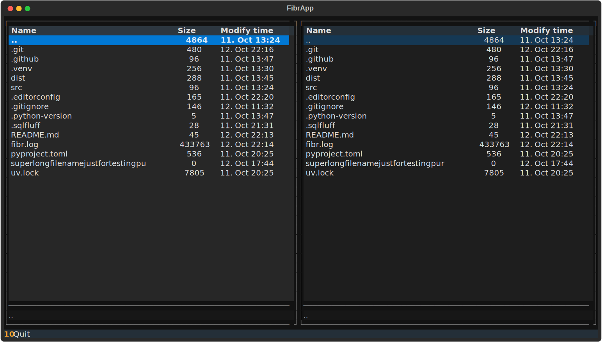

# fibr [faɪbə] - File Browser

A simple file browser with a [Midnight Commander](https://midnight-commander.org)-style interface:

- traditional dual-pane layout
- find-as-you-type per default
- basic file operations _(not implemented yet!)_

And that's about it. This will remain simple and will neither enter into competition with the original nor other popular TUI file managers (e.g. [lf](https://github.com/gokcehan/lf), [superfile](https://github.com/yorukot/superfile), [yazi](https://github.com/sxyazi/yazi) etc.).

Written in Python using the excellent [Textual](https://textual.textualize.io) framework.

## Status

This is a technical preview. I need to add basic file operations for it to be useful for me.

## License

No license yet.
